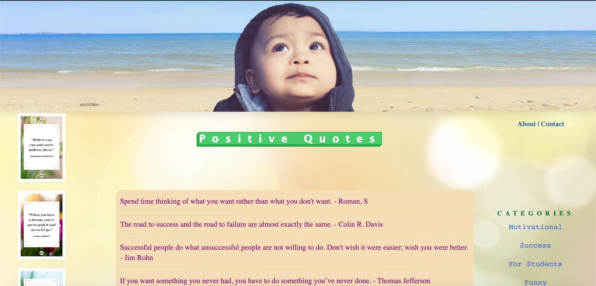

# Positive Quotes

This JS/RAILS app is about Positivity, built with Rails backend and Javascript frontend. I built this app to stay positive and motivated in the current climate of the world, where a lot of negativities are spiralling around. Users can simply go to the app and use it without having them to sign up or login. There are some categories Users can pick and go through all the positive quotes that has and, if they feel inspired they can create their own positive quotes to inspire others. This is all about spreading positivity. I hope you guys enjoy it. Stay positive.

[Click here to checkout demo video](https://www.youtube.com/watch?v=sBPXnwbElYo&ab_channel=UmaManandhar)

### Installation
To use this app, clone this repo and execute:
    
    $ bundle install
    
### Usage
    Step 1. $ Run: rails db:migrate after bundle install
    
    Step 2. $ rails db:create
    
    Step 3. $ rails db:seed
    
    Step 4. $ rails s
    
    Step 5. $ open index.html or copy path from your html file and paste it in the browser

### Contributing
Bug reports and pull requests are welcome on GitHub at https://github.com/mdr-uma/positive_quotes. This project is intended to be a safe, welcoming space for collaboration, and contributors are expected to adhere to the Contributor Covenant code of conduct.

### License
The app is available as open source under the terms of the MIT License.

### Code of Conduct
Everyone interacting in the positive_quotes project’s codebases, issue trackers, chat rooms and mailing lists is expected to follow the code of conduct.
